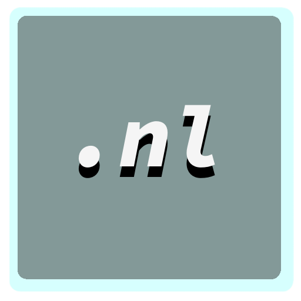

# NikLang

NikLang repository has [Ukrainian :ukraine:](#мова-програмування-niklang-ukraine) and [English :uk:](#programming-language-based-uk) localizations

# Мова програмування NikLang :ukraine:

  

**_Мова програмування NikLang_** - це проєкт в якому я намагався створити функціональну мову програмування на C++. В ході розробки якої було також створено простеньке IDE на python для роботи з NikLang, а також розширення для VS code з підсвіткою синтаксису та додаванням нової іконки. Сподіваюсь вам сподобається те що у мене вийшло і ви будете користуватись цим хоч зрідка.

**_Швидкий перехід між розділами:_**

- [NikLang](#niklang)
- [Мова програмування NikLang :ukraine:](#мова-програмування-niklang-ukraine)
  - [Синтаксис](#синтаксис)
  - [Корисні посилання](#корисні-посилання)

---

## Синтаксис

...

## Корисні посилання

**_Власне IDE:_** [https://github.com/NikitaBerezhnyj/NUB_IDE](https://github.com/NikitaBerezhnyj/NUB_IDE)

**_Розширення для VS code:_** [https://github.com/NikitaBerezhnyj/NikLang_Language_Support_for_VS_Code](https://github.com/NikitaBerezhnyj/NikLang_Language_Support_for_VS_Code)

**_Документація по проєкту:_** [https://nub-project-docs.netlify.app](https://nub-project-docs.netlify.app)
